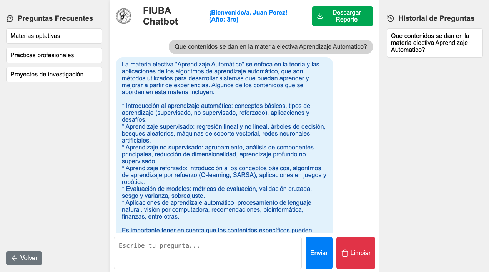

<p align="center">
  
</p>

<p align="center">
  
</p>


## GraphRAG

GraphRAG (Graph Retrieval-Augmented Generation) es una técnica avanzada que combina sistemas de búsqueda basada en grafos y modelos de lenguaje natural para responder a consultas complejas. La idea central es estructurar y almacenar información de manera semántica utilizando un grafo de conocimiento, mientras se emplean embeddings vectoriales para realizar búsquedas precisas y contextuales. Esta arquitectura tiene las siguientes ventajas:

1. **Recuperación basada en contexto**: Permite buscar información no solo por palabras clave, sino también por relaciones semánticas y similitudes vectoriales, lo que mejora la precisión y relevancia de las respuestas.
2. **Expansión del contexto**: Al extraer relaciones y entidades conectadas, se enriquece el contexto disponible para la generación de respuestas, proporcionando resultados más completos y útiles.
3. **Escalabilidad**: La estructura basada en grafos es altamente eficiente para manejar datos complejos y altamente interrelacionados.
4. **Explicabilidad**: El uso de grafos permite rastrear de manera explícita las conexiones entre la consulta del usuario y las respuestas generadas, aumentando la transparencia del sistema.
5. **Interoperabilidad**: Facilita la integración de múltiples fuentes de datos estructurados y no estructurados, como documentos, bases de datos y sistemas externos.
Con esta arquitectura, GraphRAG permite obtener respuestas precisas y contextualmente ricas para consultas en dominios complejos y densos en datos, como el análisis de documentos o el soporte técnico especializado.


## Creacion del grafo Neo4j
1. Se cargan todos los documentos PDF que se encuentren en `./backend/documents`
2. Se divide cada documento en chunks
3. A cada chunk se le calcula el vector embedding utilizando `HuggingFace` y el modelo `sentence-transformers/msmarco-distilbert-base-tas-b` (los embeddings tienen dimension 768).
4. Se crea un Nodo por cada documento que tiene como propiedades un id unico.
5. Se crea un Nodo por cada chunk que tiene como propiedades un id unico, el texto y el embedding.
6. Se crean relaciones entre cada chunk con el documento al que pertenece del tipo `(Chunk)-PART_OF->(Document)`
7. Utilizando [`LLMGraphTransformer`](https://python.langchain.com/v0.1/docs/use_cases/graph/constructing/#llm-graph-transformer), se extraen entidades y relaciones por cada chunk y se agregan al grafo Neo4j. Cada entidad se relaciona con el chunk del cual fue extraida con una relacion del tipo `(Chunk)-HAS_ENTITY->(Entity)`. Las entidades pueden tener relaciones entre sí dependiendo como la LLM haya decidido extraerlas/crearlas.
8. Se crea el `Vector Index` el cual va a ser consultado para buscar similitudes entre la query del usuario y los embeddings generados para cada chunk previamente. Se utiliza la funcion de similaridad `Cosine`.

### Para crear el grafo a partir de los documentos PDF que haya en ./backend/documents, se tiene que levantar el backend y pegarle al endpoint con curl:
```
curl -X POST http://127.0.0.1:5000/create_kg -H "Content-Type: application/json"
```

## Vector Rag
1. Por cada pregunta/query ingresada por el usario se obtiene el embedding, utilizando el mismo proveedor de embeddings utilizado para crear los embeddings de los chunks de cada documento (HugginFace, modelo sentence-transformers/msmarco-distilbert-base-tas-b y una dimension de 768).
2. El Vector Index de Neo4j al recibir el embedding busca en su Indice por el top K de vectores mas cercanos. El top k es una constante setteada en 3, que puede ser modificada (NUMBER_OF_DOCUMENTS_RETRIEVED = 3).
3. Obtiene los chunks mas parecidos al embedding de la consulta del usuario, su puntaje de similitud y realiza una Retrieval Query que le permite expandir su contexto: Por cada chunk obtenido, busca en el grafo todas las entidades relacionadas a ese chunk y por cada entidad todas sus aristas/relaciones y devuelve todo eso como contexto.
4. Se le pasa a la LLM ChatGroq un prompt que tiene instrucciones especificas sobre que responder y el contexto obtenido del Vector Index en el paso 3. Se invoca a esta LLM y se devuelve el resultado. 
 

## Como correr


1. Crear archivo `.env` y reemplzar los valores reales (mirar `.env.example`):
     - [Obtener Groq Api Key](https://console.groq.com/keys) y setearla en .env 
     - [Crear instancia Neo4j Aura](https://neo4j.com/docs/aura/auradb/getting-started/create-database/#:~:text=To%20create%20an%20AuraDB%20Virtual,storage%20allocated%20to%20the%20instance.) y setear credenciales en .env:
2. Activar virtual env:
```
cd backend
python3 -m venv venv
source venv/bin/activate
```
3. Instalar dependencias:
```
cd backend
pip install -r requirements.txt
```
4. Correr backend:
```
cd backend
python3 main.py
```
5. Correr frontend:
```
cd frontend
npm install
npm start
```
